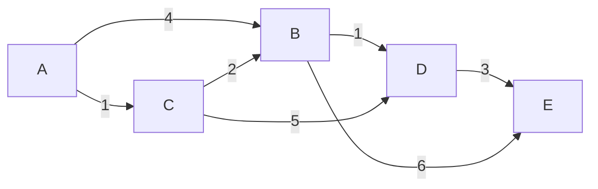

# Class: Graphs

> Canonical class for the `graphs` topic — the heaviest single block in the set. Living document; fold new templates/pitfalls back in as problems reveal them.

---

## 1. Context & when to reach for it

A **graph** is nodes (vertices) connected by **edges**. Trees and linked lists are special cases; graphs add the two complications that define the topic: **cycles** (so you need a `visited` set) and **multiple paths** between nodes (so "shortest/cheapest" becomes a real question).

Key axes that change the algorithm:
- **Directed vs undirected** — directed edges go one way (course prereqs, flights); undirected both ways (friendships, adjacency).
- **Weighted vs unweighted** — unweighted = "fewest edges" (BFS); weighted = "least total cost" (Dijkstra/Bellman-Ford).
- **Explicit vs implicit** — explicit: you're given edges/adjacency. **Implicit**: the graph is hidden — grid cells with 4-directional neighbors (LC 200, 994, 1631), or states connected by moves (LC 815 stops↔routes, LC 847 bitmask states). Recognizing the implicit graph is half the battle.

**Signals you're in graph territory:**
- Grid + "connected regions / islands / flood fill / shortest path in a maze".
- "Prerequisites", "ordering", "dependencies", "can you finish" → topological sort.
- "Connected components", "groups", "provinces", "redundant connection" → DFS/BFS or Union-Find.
- "Shortest / cheapest / minimum cost path" with weights → Dijkstra (non-negative) or Bellman-Ford (negative / k-stops).
- "Fewest steps / moves / transfers" unweighted → BFS.

> Rule of thumb: **unweighted shortest path → BFS. Weighted shortest path → Dijkstra. Ordering with dependencies → topo sort. Dynamic connectivity / "are these joined" → Union-Find.**

---

## 2. Mental model

Every graph algorithm is a disciplined way of **exploring nodes while never processing the same one twice**. The skeleton is always: a frontier (stack/queue/heap), a `visited` marker, and a rule for expanding neighbors. What changes is *the frontier's ordering*:

- **Stack / recursion (DFS)** — go deep first. Components, cycle detection, topo sort, path existence.
- **Plain queue (BFS)** — expand in rings of equal distance. **Unweighted shortest path** falls out for free: the first time you reach a node is via a shortest path.
- **Min-heap / priority queue (Dijkstra)** — always expand the cheapest-so-far node. **Weighted shortest path** with non-negative edges.

**The single most important habit: mark visited at the right moment.** For BFS shortest path, mark a node visited **when you enqueue it** (not when you dequeue), or you'll enqueue duplicates and blow up. For DFS components, mark on entry.

**Representations:**
- **Adjacency list** `List<int>[]` or `Dictionary<int, List<int>>` — default; O(V+E) space, iterate neighbors cheaply.
- **Adjacency matrix** `int[V][V]` — dense graphs / O(1) edge lookup (LC 547 sometimes given this way).
- **Implicit** — neighbors computed on the fly (grid: 4 directions; build adjacency from `edges`/`routes` first).

---

## 3. Core patterns

### A. Flood fill / connected components (DFS or BFS)
Count or label regions. Walk from each unvisited node, marking everything reachable. Component count = number of fresh starts. (LC 200 Islands, LC 547 Provinces.)

### B. Multi-source BFS
Seed the queue with **all** sources at once, then BFS. Distances come out as "min distance to *any* source." (LC 994 Rotting Oranges — all rotten cells start at time 0.)

### C. Topological sort (directed acyclic ordering)
Order nodes so every edge points forward. Two methods:
- **Kahn's (BFS):** compute in-degrees, queue all in-degree-0 nodes, repeatedly pop and decrement neighbors. If you emit fewer than V nodes → a **cycle** exists. (LC 207/210.)
- **DFS post-order:** finish-order reversed = topo order; a gray/black coloring detects cycles.

### D. Cycle detection
- **Directed:** DFS with 3 colors (white/gray/black) — a back-edge to a gray node = cycle. Or Kahn's "didn't emit all nodes."
- **Undirected:** Union-Find (edge joining already-connected nodes = cycle), or DFS tracking parent. (LC 261 Valid Tree = connected ∧ exactly V−1 edges ∧ no cycle.)

### E. BFS shortest path (unweighted)
First arrival = shortest. Track distance per level (size-snapshot) or per node. For **implicit/state graphs**, the "node" may be a composite state. (LC 815 Bus Routes — BFS over stops *or* routes; LC 847 — state = (node, visited-bitmask).)

### F. Dijkstra (weighted, non-negative)
Min-heap of `(cost, node)`. Pop cheapest, relax neighbors, skip stale pops (`if cost > dist[node] continue`). (LC 743 Network Delay, LC 1631 Path With Minimum Effort — "cost" is max edge on path.)

### G. Bellman-Ford / cost-bounded BFS
Handles negative edges or a **hop limit**. Relax all edges K times for "at most K stops." (LC 787 Cheapest Flights Within K Stops.)

### H. Union-Find (Disjoint Set Union)
Near-O(1) "are these connected?" + "join". Path compression + union by rank. Dynamic connectivity, component counting, undirected cycle detection, Kruskal MST. (LC 547, 261, 305.)

---

## 4. Reusable templates (C#)

### Build adjacency list from edges
```csharp
var adj = new List<int>[n];
for (int i = 0; i < n; i++) adj[i] = new List<int>();
foreach (var e in edges) {
    adj[e[0]].Add(e[1]);
    adj[e[1]].Add(e[0]);   // omit this line for a DIRECTED graph
}
```

**Picture it.** You're handed a flat list of connections and you want, for any node, an instant list of its neighbors:

```
edges = [[0,1],[0,2],[1,2],[2,3]]      an UNDIRECTED graph drawn out:

        0 ---- 1                 adj (what we build):
        |  \   |                   adj[0] -> [1, 2]
        |   \  |                   adj[1] -> [0, 2]
        |    \ |                   adj[2] -> [0, 1, 3]
        2 ---- 3                   adj[3] -> [2]
```

Each edge `[0,1]` means "0 and 1 are connected." Because it's undirected, we record it **twice** — once under 0's list and once under 1's — so that whether we're standing on 0 or on 1, the other end shows up as a neighbor.

**What it does:** turns that flat edge list into neighbor lookups so `adj[u]` instantly gives all of `u`'s neighbors (O(1) amortized to fetch the list). This is the first step for almost every non-grid problem — you build `adj` once, then every traversal below just reads from it. The one decision that matters: add **both** directions for an undirected graph (friendships, provinces), only **one** (`e[0] -> e[1]`, the arrow goes one way) for a directed graph (course prereqs, flights). Getting this wrong silently breaks topo sort and cycle detection downstream because half the edges go missing or appear in the wrong direction.

### DFS components (grid flood fill)
```csharp
int rows = grid.Length, cols = grid[0].Length;
int[][] dirs = { new[]{1,0}, new[]{-1,0}, new[]{0,1}, new[]{0,-1} };

void Dfs(int r, int c) {
    if (r < 0 || r >= rows || c < 0 || c >= cols || grid[r][c] != '1') return;
    grid[r][c] = '0';                         // mark visited in-place
    foreach (var d in dirs) Dfs(r + d[0], c + d[1]);
}

int components = 0;
for (int r = 0; r < rows; r++)
    for (int c = 0; c < cols; c++)
        if (grid[r][c] == '1') { components++; Dfs(r, c); }
```

**Picture it.** "Flood fill" is exactly the paint-bucket tool: click one land cell and the fill spreads to every connected land cell, stopping at water/edges. We do that once per *unvisited* island and count how many times we had to start a new fill:

```
grid:  1 1 0 0          start at (0,0): a '1' we haven't seen -> components = 1
       1 0 0 1          Dfs floods all connected 1s, turning them to 0:
       0 0 1 1
       0 0 1 1                  the flood from (0,0) reaches:
                                 (0,0)->(0,1)->(1,0)   then dead-ends (neighbors are 0/edge)

after first flood:  0 0 0 0     outer loop keeps scanning... next untouched '1' is (1,3)
                    0 0 0 1  <- start there: components = 2, flood it
                    0 0 1 1
                    0 0 1 1     ...and the bottom-right block: components = 3

Dfs spreading from one cell (arrows = recursive calls into the 4 neighbors):
              (r-1,c)
                 ^
     (r,c-1) <- (r,c) -> (r,c+1)
                 v
              (r+1,c)
```

**What it does:** counts connected regions in a grid. Each outer-loop cell that's still `'1'` is a fresh region we haven't reached yet — we increment the count, then `Dfs` floods the whole region to `'0'` so it's never counted again. **Marking visited in-place** (`grid[r][c] = '0'`, i.e. erasing land to water as we go) avoids needing a separate `visited` array. The bounds check + `!= '1'` guard at the very top of `Dfs` is the **base case**: it's what stops the recursion when we walk off the edge of the grid, hit water, or re-reach a cell we already flooded. Swap the four `dirs` for 8 entries if diagonal cells also count as connected. On very large grids the recursion can nest too deep and crash — convert to the explicit-stack version below to avoid stack overflow.

### DFS components — explicit stack (no recursion)
```csharp
int rows = grid.Length, cols = grid[0].Length;
int[][] dirs = { new[]{1,0}, new[]{-1,0}, new[]{0,1}, new[]{0,-1} };

void DfsIter(int sr, int sc) {
    var stack = new Stack<(int r, int c)>();
    grid[sr][sc] = '0';                       // mark on PUSH (see note)
    stack.Push((sr, sc));
    while (stack.Count > 0) {
        var (r, c) = stack.Pop();
        foreach (var d in dirs) {
            int nr = r + d[0], nc = c + d[1];
            if (nr < 0 || nr >= rows || nc < 0 || nc >= cols || grid[nr][nc] != '1')
                continue;
            grid[nr][nc] = '0';               // mark BEFORE pushing
            stack.Push((nr, nc));
        }
    }
}

int components = 0;
for (int r = 0; r < rows; r++)
    for (int c = 0; c < cols; c++)
        if (grid[r][c] == '1') { components++; DfsIter(r, c); }
```

**Picture it.** Same flood fill, but instead of the computer's hidden call stack we keep our *own* to-do pile of cells. We pop a cell, look at its neighbors, and push the land ones back onto the pile:

```
grid:  1 1 0       stack (top on the right), '0' = already flooded
       1 0 0

start (0,0), mark it 0, push it       stack: [(0,0)]
pop (0,0) -> neighbors (1,0) and (0,1) are land -> mark+push both
                                      stack: [(1,0),(0,1)]
pop (0,1) -> its land neighbors already 0 -> push nothing
                                      stack: [(1,0)]
pop (1,0) -> neighbors already 0/water -> push nothing
                                      stack: []   (empty -> region done)
```

Notice every cell is pushed **exactly once** — because we flip it to `'0'` the instant we decide to push it, not later when we pop it.

**What it does:** the exact same flood fill as the recursive version, but the call stack is replaced by an **explicit `Stack<T>`** (a pile we manage by hand) — so it can't blow the runtime stack on a huge grid (a snake-shaped or all-land grid of ~10⁶ cells is the killer case for recursion). The mechanics: pop a cell, look at its four neighbors, and push each land neighbor after flipping it to `'0'`.

The one subtlety that trips people up: **mark visited at push time, not pop time.** If you only mark when you *pop*, the same cell can be pushed many times by different neighbors before it's ever popped, so the stack balloons and you may double-count work. By writing `grid[nr][nc] = '0'` immediately before `Push`, each cell enters the stack exactly once — the iterative analogue of "mark on enqueue" in BFS. (The start cell is marked the same way before the initial push.) Note this is still DFS in spirit even though we don't recurse: a `Stack` gives the same deep-first frontier ordering that recursion's call stack does; swap the `Stack` for a `Queue` and the identical code becomes BFS. Same O(V+E) time and O(V) worst-case auxiliary space as the recursive form — but the space is now heap-allocated and bounded by your memory, not the (much smaller) thread stack.

### BFS shortest path (unweighted)
```csharp
var q = new Queue<int>();
var dist = new int[n]; Array.Fill(dist, -1);
q.Enqueue(src); dist[src] = 0;
while (q.Count > 0) {
    int u = q.Dequeue();
    foreach (int v in adj[u]) {
        if (dist[v] == -1) {                  // mark on ENQUEUE
            dist[v] = dist[u] + 1;
            q.Enqueue(v);
        }
    }
}
```

**Picture it.** BFS explores in **rings**: first all nodes 1 step away, then all nodes 2 steps away, and so on. Because the rings grow outward evenly, the *first* time you touch a node is guaranteed to be by a shortest route:

```
graph:   0 - 1 - 3            BFS from 0:
          \  |
           2 -+              ring 0 (dist 0):  0
                             ring 1 (dist 1):  1, 2   (0's neighbors)
                             ring 2 (dist 2):  3      (reached via 1 or 2)

dist array fills in as rings expand:
   start:  dist = [0, -1, -1, -1]   queue: [0]
   pop 0:  dist = [0,  1,  1, -1]   queue: [1,2]     (set 1 and 2, enqueue them)
   pop 1:  dist = [0,  1,  1,  2]   queue: [2,3]     (set 3)
   pop 2:  (neighbors already set) queue: [3]
   pop 3:  done                     queue: []
```

**What it does:** finds the fewest-edges distance from `src` to every node. BFS expands in those concentric rings, so **the first time a node is reached is along a shortest path** — no need to ever revisit and shorten it later (that's the unweighted win over Dijkstra). The `dist[v] == -1` test does double duty: it's both the `visited` check ("have I seen v yet?") *and* the initial "unreached" sentinel. Critical detail: we set `dist[v]` and enqueue **in the same breath** — marking on enqueue, not on dequeue — so a node never enters the queue twice. Any `-1` left at the end means that node is unreachable from `src`.

### Multi-source BFS (seed all sources)
```csharp
var q = new Queue<(int r, int c)>();
foreach source cell -> q.Enqueue(cell);       // all at distance 0
// then standard BFS; first arrival = min distance to any source
```

**Picture it.** Instead of one starting point, drop *many* starting points into the queue at distance 0 and let all their rings expand at the same time. Every cell ends up labeled with its distance to the **nearest** starter:

```
grid (2 = rotten orange = source, 1 = fresh, 0 = empty):

   2 1 1            both 2's go in the queue at time 0
   1 1 0            the rings from both sources spread simultaneously:
   0 1 2
                    time 0:  the two 2's
                    time 1:  cells touching a 2
                    time 2:  next ring out ...
   final arrival times (min dist to ANY source):
   0 1 2
   1 2 1
   . 1 0
```

If we'd run a separate BFS from each source one at a time, we'd redo the same work over and over (O(sources × grid)). Seeding them together does it in a single sweep.

**What it does:** computes the min distance from the *nearest* of many sources at once. By seeding **all** sources at distance 0 before the loop starts, the rings expand outward from every source together, so the first arrival at any cell is its distance to the closest source. The classic use is LC 994 Rotting Oranges: all rotten cells start the clock together, and the answer is the last cell's arrival time (or -1 if some fresh cell is never reached).

### Topological sort — Kahn's (BFS)
```csharp
var indeg = new int[n];
foreach (var e in edges) indeg[e[1]]++;       // edge u -> v
var q = new Queue<int>();
for (int i = 0; i < n; i++) if (indeg[i] == 0) q.Enqueue(i);
var order = new List<int>();
while (q.Count > 0) {
    int u = q.Dequeue(); order.Add(u);
    foreach (int v in adj[u]) if (--indeg[v] == 0) q.Enqueue(v);
}
bool hasCycle = order.Count != n;             // didn't emit all -> cycle
```

**Picture it.** Think of courses with prerequisites. **In-degree** = how many prereqs a course still has unmet. You can only take a course once its in-degree hits 0; taking it then "frees up" the courses that depended on it (decrement their in-degrees):

```
edges (u -> v means "u before v"):  0->2, 1->2, 2->3

        0 ---\
              >-- 2 --> 3          in-degrees:  0:0  1:0  2:2  3:1
        1 ---/

start: queue everyone with in-degree 0      queue: [0, 1]      order: []
pop 0 -> emit, decrement 2 (2->1)           queue: [1]         order: [0]
pop 1 -> emit, decrement 2 (2->0) -> queue  queue: [2]         order: [0,1]
pop 2 -> emit, decrement 3 (3->0) -> queue  queue: [3]         order: [0,1,2]
pop 3 -> emit                               queue: []          order: [0,1,2,3]

order.Count == 4 == n  ->  no cycle, valid ordering found.
```

If there were a cycle (say `2->3` and `3->2`), those nodes would *never* reach in-degree 0, so they'd never get emitted and `order.Count` would fall short of `n`.

**What it does:** linearizes a directed graph so every edge points forward (prerequisites before dependents). A node is ready to emit only when its in-degree hits 0. We start with all already-ready nodes, and each time we emit one we "satisfy" its outgoing edges by decrementing neighbors' in-degrees, queuing any that reach 0. The cycle test is the elegant part: in a cycle no node ever reaches in-degree 0, so if `order.Count != n`, a cycle exists and **no valid ordering is possible** (LC 207 returns false; LC 210 returns empty).

### Dijkstra (weighted, non-negative)
```csharp
var dist = new int[n]; Array.Fill(dist, int.MaxValue);
var pq = new PriorityQueue<int, int>();       // (node, cost)
dist[src] = 0; pq.Enqueue(src, 0);
while (pq.Count > 0) {
    pq.TryDequeue(out int u, out int d);
    if (d > dist[u]) continue;                // stale entry, skip
    foreach (var (v, w) in adj[u]) {
        if (dist[u] + w < dist[v]) {
            dist[v] = dist[u] + w;
            pq.Enqueue(v, dist[v]);
        }
    }
}
```

**Picture it.** Now edges have *weights* (costs). BFS's ring trick breaks because a path with more edges can still be cheaper. Dijkstra fixes this with a **min-heap** that always hands back the cheapest-known node next. Worked example, shortest paths from **A**:



Pop the unvisited node with smallest `dist`, then relax its outgoing edges:

| Step | Pop (dist) | Relaxations | dist after |
|------|-----------|-------------|-----------|
| init | — | — | A:0, B:∞, C:∞, D:∞, E:∞ |
| 1 | **A** (0) | B: 0+4=4 ✓, C: 0+1=1 ✓ | A:0, B:4, C:1, D:∞, E:∞ |
| 2 | **C** (1) | B: 1+2=3 < 4 ✓, D: 1+5=6 ✓ | A:0, B:3, C:1, D:6, E:∞ |
| 3 | **B** (3) | D: 3+1=4 < 6 ✓, E: 3+6=9 ✓ | A:0, B:3, C:1, D:4, E:9 |
| 4 | **D** (4) | E: 4+3=7 < 9 ✓ | A:0, B:3, C:1, D:4, E:7 |
| 5 | **E** (7) | (no outgoing) | A:0, B:3, C:1, D:4, E:7 |

Final: A:0, C:1 (A→C), B:3 (A→C→B), D:4 (A→C→B→D), E:7 (A→C→B→D→E).

The instructive moment is **step 2**: popping C (dist 1) *lowers* B from 4 → 3 and enqueues a second `B:3` entry. The heap pops `B:3` before the stale `B:4`, so B is finalized at 3 and the leftover `B:4` is discarded by the `if (d > dist[u]) continue` guard when it surfaces. B is enqueued twice but never *popped* at the wrong value — that's the min-heap doing its job.

Because every edge cost is ≥ 0, the moment a node is *popped* (it was the cheapest in the heap), its distance can never be beaten — so it's final. That guarantee is the whole reason Dijkstra works.

**What it does:** finds the least-*total-cost* path with non-negative weights. The min-heap always hands you the cheapest-so-far node, and because edges are non-negative, **the first time you pop a node its distance is final**. The `if (d > dist[u]) continue` line is essential: C#'s `PriorityQueue` can't "decrease-key" (update an entry already in the heap), so we just leave stale `(node, oldCost)` entries lying around and skip them when they pop. "Relaxing" an edge means: if routing through `u` beats `v`'s best known cost, update it and push the new, cheaper entry. For variants where path cost isn't a running sum (LC 1631, cost = the single biggest edge on the path), replace `dist[u] + w` with `Math.Max(dist[u], w)`.

### Union-Find (path compression + union by rank)
```csharp
int[] parent, rank_;
int Find(int x) => parent[x] == x ? x : parent[x] = Find(parent[x]); // path compression
bool Union(int a, int b) {
    int ra = Find(a), rb = Find(b);
    if (ra == rb) return false;               // already joined -> cycle
    if (rank_[ra] < rank_[rb]) (ra, rb) = (rb, ra);
    parent[rb] = ra;
    if (rank_[ra] == rank_[rb]) rank_[ra]++;
    return true;
}
```

**Picture it.** Each group is a little tree; the **root** is the group's ID. To ask "are a and b together?" you climb both to their roots and compare. To merge groups, you hang one root under the other:

```
start: everyone is their own group (parent[i] = i)
   0   1   2   3   4         roots: 0 1 2 3 4

Union(0,1): hang 1 under 0          Union(2,3): hang 3 under 2
   0     2   4                         0       2     4
   |     |                             |       |
   1     3                             1       3

Union(1,3): Find(1)=0, Find(3)=2 -> hang 2 under 0
        0
       / \
      1   2          now 0,1,2,3 share root 0  ->  all connected
          |
          3

Union(0,2) again? Find(0)=Find(2)=0 -> already same root -> returns false (a cycle!)
```

**Path compression** means after you climb to the root, you re-point the nodes you passed *directly* at the root, so the next climb is instant. **Union by rank** always hangs the shorter tree under the taller one so the trees stay shallow.

**What it does:** answers "are these two nodes in the same group?" and "merge their groups" in near-constant time. `Find` returns a component's representative (root); two nodes are connected iff they share a root. `Union` returning `false` means both nodes were *already* connected — joining them would close a cycle, which is exactly the undirected cycle-detection signal (LC 261: a valid tree has `n-1` edges and every `Union` succeeds). Initialize `parent[i] = i` and `rank_[i] = 0` before use.

### Bellman-Ford / K-stops relaxation (LC 787)
```csharp
var dist = new int[n]; Array.Fill(dist, int.MaxValue); dist[src] = 0;
for (int i = 0; i <= K; i++) {                // at most K stops = K+1 edges
    var tmp = (int[])dist.Clone();            // use last round's dist only
    foreach (var (u, v, w) in flights)
        if (dist[u] != int.MaxValue && dist[u] + w < tmp[v]) tmp[v] = dist[u] + w;
    dist = tmp;
}
```

**Picture it.** "At most K stops" caps how many flights (edges) a path may use. Each round of relaxing *all* edges lets every path grow by exactly one more edge, so after round `i` you know the cheapest fare reachable in `i` flights:

```
flights: 0->1 ($100), 1->2 ($100), 0->2 ($500)   src=0, K=1 stop (so ≤ 2 flights)

     0 --100--> 1 --100--> 2
     |                     ^
     +--------500----------+

dist after each round (read from LAST round's snapshot each time):
   start:   [0,   ∞,   ∞ ]
   round 0: [0, 100, 500]   (one flight: 0->1=100, 0->2=500)
   round 1: [0, 100, 200]   (two flights: 0->1->2 = 200 beats 500)

With K=1 we stop here -> cheapest to 2 is $200.
```

The `tmp = dist.Clone()` is the trick: by reading only last round's numbers, a single round can't secretly chain two flights together and blow past the K-flight budget.

**What it does:** finds the cheapest path using **at most K stops** (K+1 edges). Each round of the outer loop relaxes *every* edge once, extending every shortest path by one more edge — so after round `i`, `dist` holds the cheapest cost reachable in `i` edges. The must-not-skip detail is `tmp = dist.Clone()`: we read from **last round's** distances and write into a fresh copy, so one round can't chain multiple edges and exceed the K-edge budget. Unlike Dijkstra this tolerates negative edge weights (it just can't have negative *cycles*). We loop `K+1` times because "K stops" allows K+1 flights.

---

## 5. Common pitfalls

- **Marking visited on dequeue instead of enqueue (BFS)** → the same node enters the queue many times; can blow memory/time and corrupt distances. Mark when you *add* it.
- **No `visited` set at all** → infinite loops on cycles. Trees let you skip it; graphs never do.
- **Directed vs undirected mix-up** — adding both edge directions on a directed graph (or vice versa) silently breaks topo sort / cycle logic.
- **Dijkstra with negative edges** → wrong answer. Use Bellman-Ford. And don't forget the **stale-pop skip** (`if d > dist[u] continue`) or it's slow.
- **K-stops without snapshotting last round** (LC 787) — relaxing within the same array lets a path use >K edges in one pass. Clone `dist` each round.
- **Recursion depth on big grids** — DFS flood fill on a 10⁶-cell grid can overflow the stack; switch to iterative BFS/stack.
- **Building adjacency wrong for implicit graphs** — LC 815: connect *stops to routes* (bipartite) or precompute route-to-route adjacency; naive stop→stop is O(stops²) and TLEs.
- **Counting components: forgetting to start only from unvisited nodes** → over-counts.
- **Topo sort: not detecting the cycle** — if `order.Count != n`, there's no valid ordering; many problems hinge on returning that.

---

## 6. Complexity cheat sheet

| Algorithm | Time | Space | Use for |
|---|---|---|---|
| DFS / BFS traversal | O(V + E) | O(V) | components, reachability, unweighted dist |
| Multi-source BFS | O(V + E) | O(V) | min dist to any source |
| Topological sort (Kahn / DFS) | O(V + E) | O(V) | dependency ordering, cycle detect |
| Dijkstra (binary heap) | O((V + E) log V) | O(V) | weighted shortest path, non-neg |
| Bellman-Ford | O(V · E) | O(V) | negative edges, K-hop limit |
| Union-Find (with both opts) | ~O(α(N)) per op | O(N) | dynamic connectivity, undirected cycle |

`V` = vertices, `E` = edges, `α` = inverse Ackermann (≈ constant).

---

## 7. Map to the problem set (Topic 11 — Graphs, 15 problems)

| # | LC | Pattern from above |
|---|---|---|
| 73 | 200 Number of Islands | A — grid flood fill (★) |
| 74 | 133 Clone Graph | DFS/BFS + node→clone map (cf. LC 138) |
| 75 | 207 Course Schedule | C/D — topo sort cycle detection (★) |
| 76 | 210 Course Schedule II | C — topo sort, emit order |
| 77 | 994 Rotting Oranges | B — multi-source BFS (⚑) |
| 78 | 261 Graph Valid Tree | D/H — connected ∧ V−1 edges ∧ acyclic |
| 79 | 547 Number of Provinces | A/H — components via DFS or Union-Find |
| 80 | 743 Network Delay Time | F — Dijkstra (★) |
| 81 | 1631 Path With Minimum Effort | F — Dijkstra, cost = max edge on path |
| 82 | 815 Bus Routes | E — BFS on implicit stop/route graph (★ ⚑) |
| 83 | 269 Alien Dictionary | C — build edges from adjacent words + topo sort (★ ⚑) |
| 84 | 332 Reconstruct Itinerary | Hierholzer's Eulerian path (⚑) |
| 85 | 847 Shortest Path Visiting All Nodes | E — BFS over (node, visited-bitmask) state (★ ⚑) |
| 86 | 305 Number of Islands II | H — Union-Find with incremental adds (R) |
| 87 | 787 Cheapest Flights Within K Stops | G — Bellman-Ford / cost-bounded BFS (R) |

Related elsewhere: grid DFS reuses backtracking (Topic 12); Dijkstra reuses the heap (Topic 7); the trie-pruned grid DFS (LC 212) is the same 4-direction walk.
